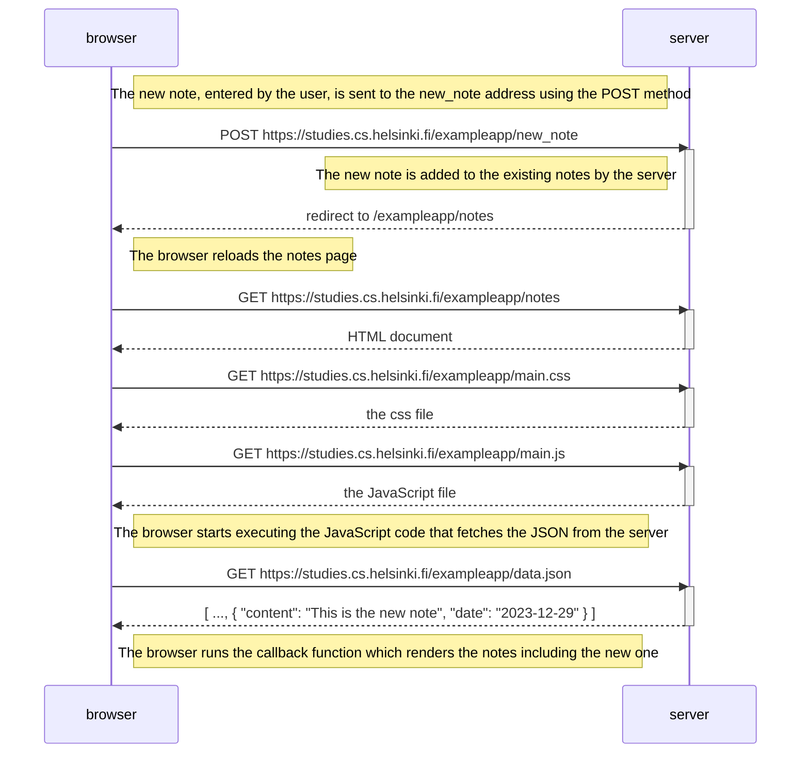

```mermaid
sequenceDiagram
    participant browser
    participant server

    Note right of browser: The new note, entered by the user, is sent to the new_note address using the POST method
    
    browser->>server: POST https://studies.cs.helsinki.fi/exampleapp/new_note
    activate server
    Note left of server: The new note is added to the existing notes by the server
    server-->>browser: redirect to /exampleapp/notes
    deactivate server
    
    Note right of browser: The browser reloads the notes page 

    browser->>server: GET https://studies.cs.helsinki.fi/exampleapp/notes
    activate server
    server-->>browser: HTML document
    deactivate server

    browser->>server: GET https://studies.cs.helsinki.fi/exampleapp/main.css
    activate server
    server-->>browser: the css file
    deactivate server

    browser->>server: GET https://studies.cs.helsinki.fi/exampleapp/main.js
    activate server
    server-->>browser: the JavaScript file
    deactivate server

    Note right of browser: The browser starts executing the JavaScript code that fetches the JSON from the server

    browser->>server: GET https://studies.cs.helsinki.fi/exampleapp/data.json
    activate server
    server-->>browser: [ ..., { "content": "This is the new note", "date": "2023-12-29" } ]
    deactivate server

    Note right of browser: The browser runs the callback function which renders the notes including the new one
```
