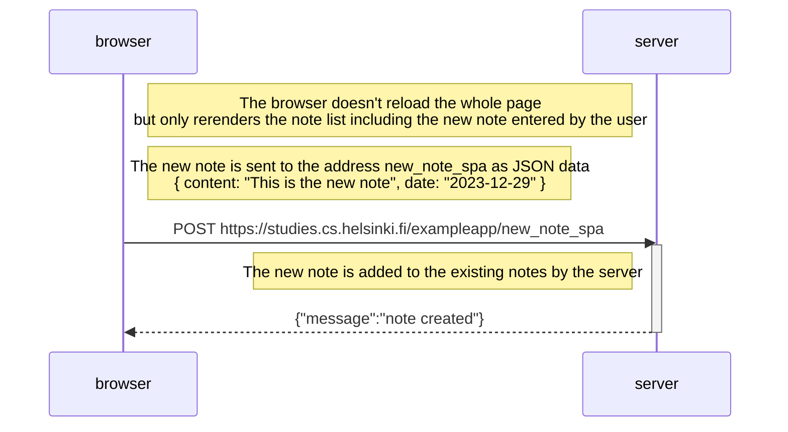

```mermaid
sequenceDiagram
    participant browser
    participant server

    Note right of browser: The browser doesn't reload the whole page <br /> but only rerenders the note list including the new note entered by the user
    Note right of browser: The new note is sent to the address new_note_spa as JSON data<br /> { content: "This is the new note", date: "2023-12-29" }
    browser->>server: POST https://studies.cs.helsinki.fi/exampleapp/new_note_spa
    activate server
    Note left of server: The new note is added to the existing notes by the server
    server-->>browser: {"message":"note created"}
    deactivate server


```

